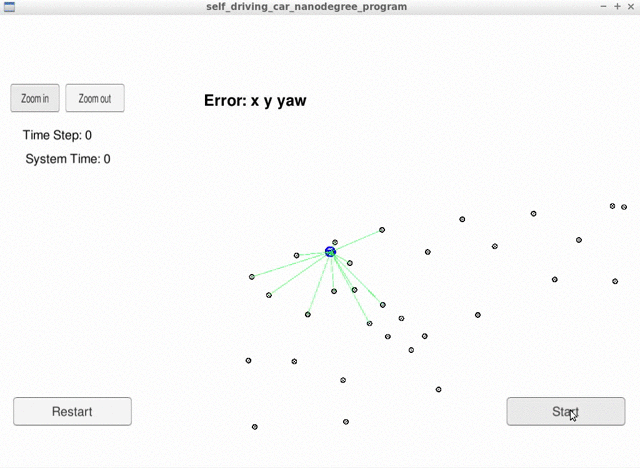

# CarND-Kidnapped-Vehicle-Project

<!-- Self-Driving Car Engineer Nanodegree Program -->

[](http://www.udacity.com/drive)




# Overview
This repository contains all the code for the kidnapped vehicle project. The project shows the implementation of a [Particle Filter](https://en.wikipedia.org/wiki/Particle_filter) that applied to a Kidnapped robot (vehicle). This project involves a Simulator which can be downloaded [here](https://github.com/udacity/self-driving-car-sim/releases), that provided by [Udacity](https://www.udacity.com/course/self-driving-car-engineer-nanodegree--nd013). The simulator generating noisy landmark observation from a car to the Particle Filter using [WebSocket](https://en.wikipedia.org/wiki/WebSocket). This project involve using an open source package called [uWebSocketIO](https://github.com/uNetworking/uWebSockets). This package facilitates the connection between the simulator and the code with C++. The Particle Filter uses the uWebSockets, WebSocket implementation to respond to this observation with the estimated car position. The actual project's repo provided by Udacity could be found [here](https://github.com/udacity/CarND-Kidnapped-Vehicle-Project).


## Project Introduction
A robot has been kidnapped and transported to a new location! Luckily it has a map of this location, a (noisy) GPS estimate of its initial location, and lots of (noisy) sensor and control data.

In this project implemented a 2 dimensional particle filter in C++. The particle filter given a map and some initial localization information (analogous to what a GPS would provide). The particle filter get observation and control data at each time step.

## Important Dependencies

The minimum project dependency versions are:

* cmake >= 3.5
  * All OSes: [click here for installation instructions](https://cmake.org/install/)
* make >= 4.1 (Linux, Mac), 3.81 (Windows)
  * Linux: make is installed by default on most Linux distros
  * Mac: [install Xcode command line tools to get make](https://developer.apple.com/xcode/features/)
  * Windows: [Click here for installation instructions](http://gnuwin32.sourceforge.net/packages/make.htm)
* gcc/g++ >= 5.4
  * Linux: gcc / g++ is installed by default on most Linux distros
  * Mac: same deal as make - [install Xcode command line tools](https://developer.apple.com/xcode/features/)
  * Windows: recommend using [MinGW](http://www.mingw.org/)
* Udacity's Term 2 [simulator](https://github.com/udacity/self-driving-car-sim/releases)


#### uWebSocketIO Starter Guide
The package does this by setting up a web socket server connection from the C++ program to the simulator, which acts as the host. In the project repository there are two scripts for installing uWebSocketIO - one for Linux and the other for macOS.

Note: Only uWebSocketIO branch e94b6e1, which the scripts reference, is compatible with the package installation.

This repository includes two files that can be used to set up and install [uWebSocketIO](https://github.com/uWebSockets/uWebSockets) for either Linux or Mac systems. For windows you can use either Docker, VMware, or even [Windows 10 Bash on Ubuntu](https://www.howtogeek.com/249966/how-to-install-and-use-the-linux-bash-shell-on-windows-10/) to install uWebSocketIO. Please see the uWebSocketIO Starter Guide page in the classroom within the EKF Project lesson for the required version and installation scripts.


The particular project implementation was done on **Linux OS** and the rest of this documentation will be focused on Linux OS. The project also support Mac operating system.

In order to install the necessary libraries, from the project repository directory run the script either [install-ubuntu.sh](https://github.com/aliasaswad/CarND-Kidnapped-Vehicle-Project-P6/blob/master/install-ubuntu.sh)(for Mac user).

## Running the Code
This repository includes two files that can be used to set up and install uWebSocketIO for either Linux or Mac systems. For windows you can use either Docker, VMware, or even Windows 10 Bash on Ubuntu to install uWebSocketIO.

Once the install for uWebSocketIO is complete, the main program can be built and ran by doing the following from the project top directory.

1. Create a build directory: `mkdir build && cd build`
2. Compile:`cmake ..`
3. `make`, this will create executable
    -  `particle_filter`, which is our implementation
4. Finally, run `./particle_filter`


Alternatively some scripts have been included to streamline this process, these can be leveraged by executing the following in the top directory of the project:
```
$ ./clean.sh
$ ./build.sh
$ ./run.sh
```

Tips for setting up your environment can be found [here](https://classroom.udacity.com/nanodegrees/nd013/parts/40f38239-66b6-46ec-ae68-03afd8a601c8/modules/0949fca6-b379-42af-a919-ee50aa304e6a/lessons/f758c44c-5e40-4e01-93b5-1a82aa4e044f/concepts/23d376c7-0195-4276-bdf0-e02f1f3c665d)


Your job is to build out the methods in `particle_filter.cpp` until the simulator output says:

```
Success! Your particle filter passed!
```

# Implementing the Particle Filter
The directory structure of this repository is as follows:

```
root
|   build.sh
|   clean.sh
|   CMakeLists.txt
|   README.md
|   run.sh
|
|___data
|   |   
|   |   map_data.txt
|   
|   
|___src
    |   helper_functions.h
    |   main.cpp
    |   map.h
    |   particle_filter.cpp
    |   particle_filter.h
```

The only file you should modify is `particle_filter.cpp` in the `src` directory. The file contains the scaffolding of a `ParticleFilter` class and some associated methods. Read through the code, the comments, and the header file `particle_filter.h` to get a sense for what this code is expected to do.

If you are interested, take a look at `src/main.cpp` as well. This file contains the code that will actually be running your particle filter and calling the associated methods.

## Inputs to the Particle Filter
You can find the inputs to the particle filter in the `data` directory.

#### The Map*
`map_data.txt` includes the position of landmarks (in meters) on an arbitrary Cartesian coordinate system. Each row has three columns
1. x position
2. y position
3. landmark id

### All other data the simulator provides, such as observations and controls.

> * Map data provided by 3D Mapping Solutions GmbH.

## Success Criteria
If your particle filter passes the current grading code in the simulator (you can make sure you have the current version at any time by doing a `git pull`), then you should pass!

The things the grading code is looking for are:


1. **Accuracy**: your particle filter should localize vehicle position and yaw to within the values specified in the parameters `max_translation_error` and `max_yaw_error` in `src/main.cpp`.

2. **Performance**: your particle filter should complete execution within the time of 100 seconds.

## How to write a README
A well written README file can enhance your project and portfolio.  Develop your abilities to create professional README files by completing [this free course](https://www.udacity.com/course/writing-readmes--ud777).
